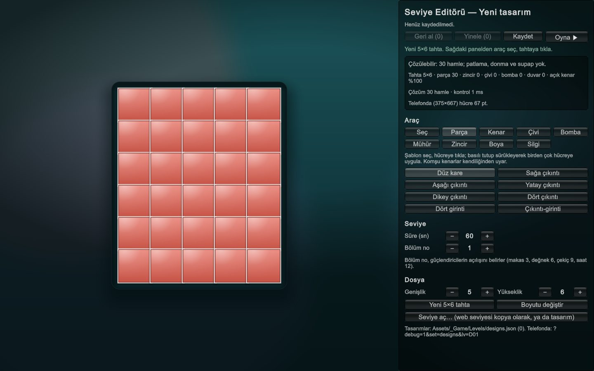
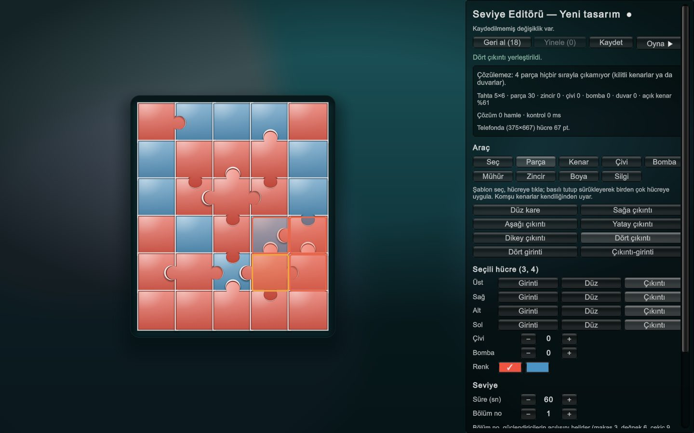
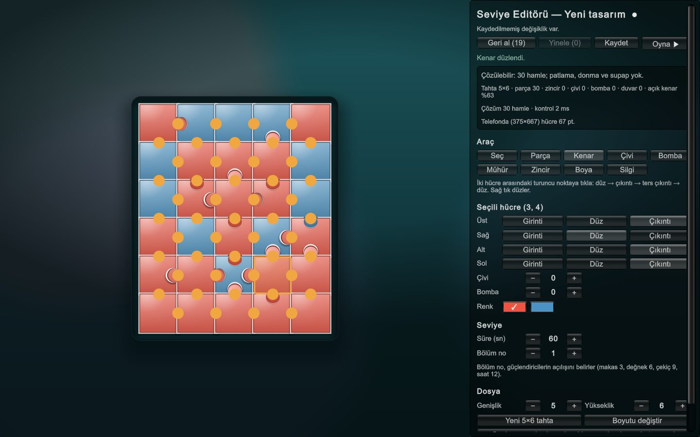
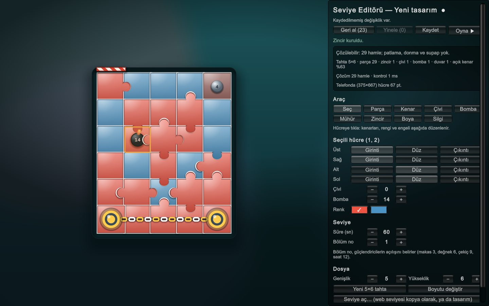
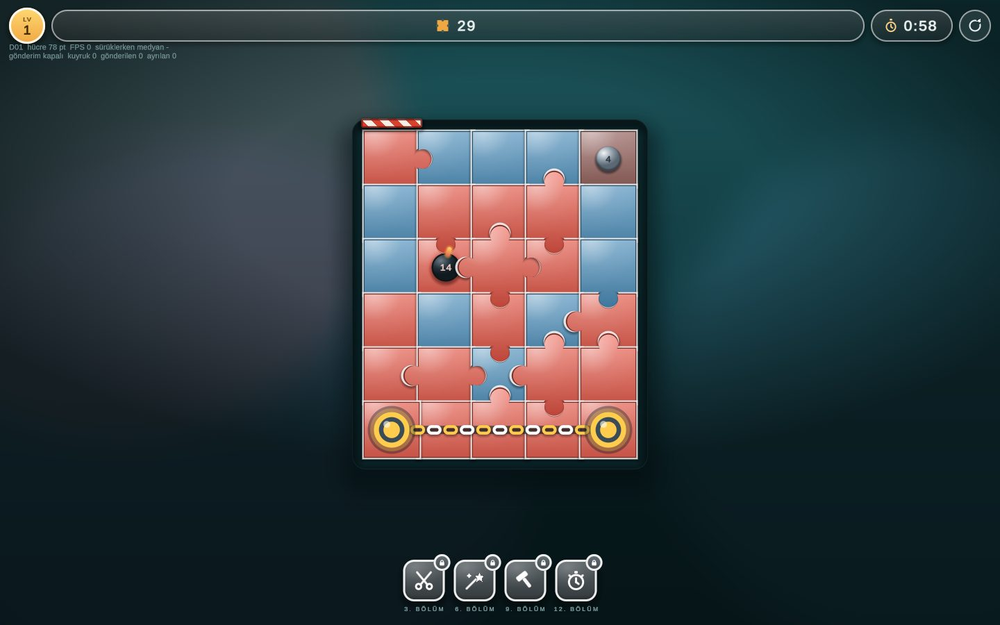
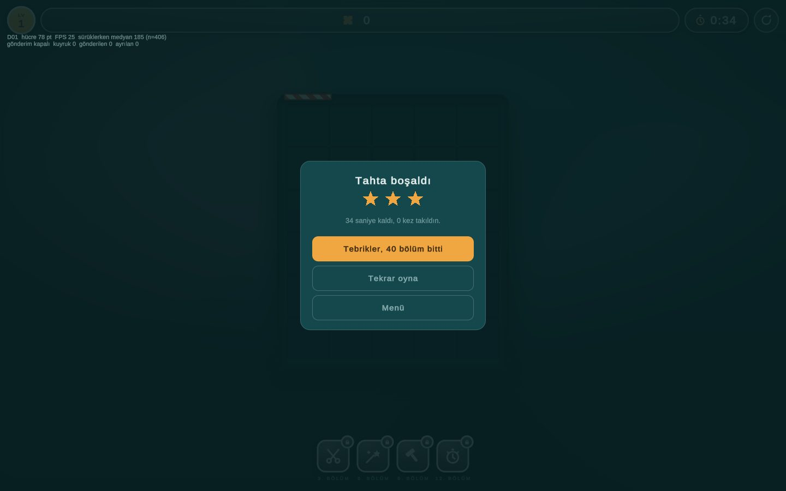

# Seviye Editörü

Unity'de, oyundaki görünümün aynısıyla seviye kurarsın. Koda ya da JSON'a dokunman gerekmez. Çözülebilirliği her değişiklikte anında görür, kaydeder ve oyunda oynarsın.

- **Açmak:** Unity menüsü **Reverse Solver → Seviye Editörü** (kısayol **Ctrl+Shift+L**). Unity Play moduna geçer ve editör açılır.
- **Game görünümünün boyutu:** Game sekmesinin üstündeki çözünürlük listesinden **"Seviye Editörü (1440x900)"** seç. Başka bir yatay boyut da olur; dikey boyutta panel aşağı iner.
- **Kapatmak:** Play'i durdur. Kaydedilmemiş değişiklik varsa Unity sorar.

Solda tahta var; oyunun kendi çizim kodu kullanıldığı için parçalar oyundakiyle birebir aynı görünür. Sağdaki panelde araçlar, seçili hücre, seviye ayarları ve canlı kontrol bulunur.

---

## İlk seviyeni kur (10 dk)

**1. Tahta.** Editör 5×6 boş bir tahtayla açılır. Başka bir boyut için **Dosya**'da Genişlik ve Yükseklik'i ayarla, sonra **Yeni … tahta**'ya bas. Var olan bir seviyeden başlamak istersen **Seviye aç…**'a bas ve bir web seviyesi (L01–L40) seç. Seçtiğin seviye kopya olarak açılır; asıl seviye hiç değişmez.

**2. Parçalar.** **Araç → Parça**'yı seç ve bir şablon seç (Dört çıkıntı, Yatay çıkıntı …). Sonra tahtada bir hücreye tıkla. Basılı tutup sürüklersen şablon birden çok hücreye uygulanır. Komşu parçaların kenarları kendiliğinden uyar; uyumsuz bir kenar oluşamaz. **Boya** aracıyla hücreleri seviyenin renklerine boyayabilirsin. Renk yalnızca görünüştür, oynanışı etkilemez.

**3. Paneli izle.** Her değişiklikten sonra kontrol kutusu yenilenir:
- **Yeşil "Çözülebilir":** tahta 0 patlama, 0 donma ve 0 supapla bitirilebilir.
- **Kırmızı "Çözülemez":** neden yazar ve sorunlu parçalar tahtada kırmızıyla işaretlenir.

Yukarıdaki örnekte dört parça birbirine kilitlenmiş durumda. **Kenar** aracını seç: iki hücre arasındaki turuncu noktaya tıklamak kenarı sırayla düz → çıkıntı → ters çıkıntı → düz yapar, sağ tık doğrudan düzler. Tek bir kenarı düzlemek tahtayı açtı:

**4. Engeller.**
- **Çivi:** sayacı ayarla, sonra hücreye tıkla.
- **Bomba:** fitili ayarla, sonra hücreye tıkla.
- **Mühür:** tahtanın dışındaki soluk şeride tıkla; o şeride duvar konur.
- **Zincir:** iki hücreye sırayla tıkla. Hücrelerin yan yana olması gerekmez; web seviyelerinde de zincirler tahtanın iki ucunu bağlar.

Sağ tık o hücredeki engeli siler. Bir engel tahtayı bozarsa panel hemen söyler; **Geri al** (Ctrl+Z) ile bir adım geri dönersin.

**5. İnce ayar.** **Seç** aracıyla bir hücreye tıkla. Panelde o hücrenin dört kenarı (Girinti / Düz / Çıkıntı), çivi sayacı, bomba fitili, rengi ve zinciri görünür; hepsini oradan değiştirebilirsin. **Seviye** bölümünde süreyi ve bölüm numarasını ayarlarsın. Bölüm numarası güçlendiricilerin açılışını belirler: makas 3, değnek 6, çekiç 9, saat 12.

**6. Kaydet.** **Kaydet**'e bas (ya da Ctrl+S). Tasarım `Assets/_Game/Levels/designs.json`'a yazılır ve kalıcı bir numara alır: D01, D02 … Silinen bir numara bir daha verilmez.

**7. Oyna.** **Oyna ▶**'ya bas. Tasarım gerçek oyunda açılır: aynı sürükleme, aynı süre, aynı kurallar. Oyunu bitirince bitiş kartındaki **Editöre dön** ya da **Menü**'ye bas, ya da **Esc**'ye bas. Editöre döndüğünde tasarımın ve geri alma geçmişin aynen durur. Kaydetmeden de oynayabilirsin.

---

## Görsel ekle

Bir tasarıma resim koyabilirsin; parçalar o resmin parçaları gibi görünür. Her tasarımın kendi resmi olur. Şimdilik yalnızca tasarımlarda (D01, D02 …) var; web'den gelen 40 seviyeye resim konmaz.

1. **Seviye** bölümünde **Görsel seç…**'e bas, bilgisayarından bir png ya da jpg seç. Kaydedilmemiş bir tasarım önce kendiliğinden kaydedilir, çünkü dosyalar tasarımın numarasıyla adlandırılır.
2. Resim tahtanın oranına göre ortadan kırpılır ve tahtada hemen görünür; panelde küçük bir önizlemesi çıkar.
3. **Kaydet**'e bas. Tasarıma `"image": "D01.jpg"` yazılır.
4. Resmi kaldırmak için **Görseli kaldır**. Parçalar renklerine döner; kullanılmayan dosyalar bir sonraki kayıtta silinir.

Bilmen gerekenler:
- Resim yalnızca görünüştür, **sürümü değiştirmez**.
- Seçtiğin dosyaya dokunulmaz. Editör ondan iki kopya çıkarır:
  - en uzun kenarı en fazla 2048 px olan bir kaynak kopyası (`Assets/_Game/Levels/ImageSources/`, oyuna girmez);
  - oyunun indireceği tahta resmi (`Assets/StreamingAssets/LevelImages/<numara>.jpg`, hücre başına yaklaşık 150 px, en uzun kenar en fazla 1024 px).
- Tahtanın boyutunu değiştirirsen resim kaynak kopyadan yeniden kırpılır.
- Resim oyunun ilk indirmesine girmez; bölüm açılınca ayrıca indirilir. Gelene kadar, ya da hiç gelmezse, bölüm renkleriyle oynanır.
- Çıkıntı ve girintilerin her resimde seçilebilmesi için beyaz dikiş kalır ve resmin kontrastı biraz yumuşatılır. Çok karışık ya da tek renk resimlerde parçaları ayırt etmek zorlaşabilir; telefonda deneyip bak.
- Kendi resimlerini kullan; başkasının telifli resmini koyma.

## Araçlar

| Araç | Ne yapar | Sağ tık |
|---|---|---|
| Seç | Hücreyi seçer; panelde kenarları, rengi ve engeli düzenlenir | Engeli siler |
| Parça | Şablonu hücreye uygular, sürükleyince birden çok hücreye | Engeli siler |
| Kenar | İki hücre arasındaki kenar: düz → çıkıntı → ters çıkıntı → düz | Kenarı düzler |
| Çivi | Çivi koyar ya da sayacını panel değerine eşitler | Kaldırır |
| Bomba | Bomba koyar ya da fitilini panel değerine eşitler | Kaldırır |
| Mühür | Tahta dışındaki şeride duvar koyar ya da kaldırır | Duvarı kaldırır |
| Zincir | İki hücreye sırayla tıkla: zincir kurulur | Zinciri ayırır |
| Boya | Hücreyi seçili renge boyar, sürükleyerek de olur | Engeli siler |
| Silgi | Hücredeki çiviyi, bombayı ve zinciri kaldırır | Aynı |

Geri alma 100 adıma kadar gider. Kısayollar (önce Game görünümüne bir kez tıkla): **Ctrl+Z** geri al, **Ctrl+Y** yinele, **Ctrl+S** kaydet. Düğmeler her zaman çalışır.

## Editörün izin vermedikleri

Bunlar web seviyelerinde de yok; editör kurmana izin vermez ve nedenini panelde yazar:

- Bir parçada hem çivi hem bomba.
- Zincirli parçada çivi. Zincirli parçada bomba olabilir; çiftin tek bir bombası olur.
- İki bombalı parçayı zincirlemek.
- Zaten zincirli bir hücreyi ikinci kez zincirlemek.
- Tahtanın dış kenarına çıkıntı. Dış kenar her zaman düzdür.

## Kontrol panelinin dili

- **Çözülebilir: N hamle; patlama, donma ve supap yok.** Tasarım kuralına uyuyor.
- **Çözülemez: K parça hiçbir sırayla çıkamıyor.** Kenarlar ya da duvarlar parçaları kilitliyor; kırmızı parçalara bak.
- **Çözülemez: bombanın fitili yetmiyor.** Bomba zamanında çıkarılamıyor. Fitili artır ya da bombanın yolunu aç.
- **Kural dışı: çözüm supap gerektiriyor.** Bitiriliyor, ama oynanabilir parçaların hepsi aynı anda çivili kalıyor ve oyun bir çiviyi kendisi söküyor.
- **Doğrulanamadı.** Hızlı bomba araması sınırına ulaştı. Bu "çözülemez" demek değil. **Derin kontrol**'e bas; birkaç saniye sürebilir.
- **Uyarı: telefonda hücre 44 pt'nin altında.** Tahta bir iPhone'da (375×667) parmakla rahat oynanamayacak kadar küçük çıkar. Genişlik en fazla 7, yükseklik en fazla 9 olursa sorun olmaz.

Kurala uymayan bir tasarımı da kaydedebilirsin; editör kaydetmeden önce uyarır. Deney için bilerek bozuk bir tahta gerekebilir.

## Sürüm (version) kuralı

- **Sürüm 1 artar** (oynanışı etkileyen değişiklikler): boyut, kenarlar, zincir, çivi ve sayacı, bomba ve fitili, duvar, süre, güçlendirici stokları ve açılışları, bölüm numarası.
- **Sürüm aynı kalır** (görünüş değişiklikleri): renk, palet, resim adı, tanıtım kartı metni.
- Kaydetmeden yapılan birçok değişiklik, kaydedince sürümü yalnızca 1 artırır.
- Telemetri satırları `level_id` + `level_version` taşıdığı için, değişmiş bir tasarımın verisi eski sürümünkiyle karışmaz.

## Telefonda denemek

Tasarımlar web build'ine girer ama normal oyuncu onları görmez. Yalnızca debug adresiyle açılırlar:

- Tasarım listesi: `https://zeydusht.github.io/reverse-solver-unity/br/?debug=1&set=designs`
- Belirli bir tasarım: `https://zeydusht.github.io/reverse-solver-unity/br/?debug=1&set=designs&lv=D01`

Debug oturumları hiçbir zaman Supabase'e gönderilmez, yani denemelerin veriyi kirletmez. Yeni ya da değişmiş bir tasarımın telefona gelmesi için build alınıp yayınlanması gerekir. Bunu Claude'a "tasarımları yayınla" diyerek yaptırırsın.

## Dosyalar

- `Assets/_Game/Levels/designs.json`: tasarımlar, satır başına bir tasarım. `levels.json` ile aynı biçimde; ek olarak `nextId` var.
- `Assets/_Game/Levels/levels.json`: web'den gelen 40 seviye. Editör bu dosyaya hiç yazmaz.
- Editörün kodu yalnızca Unity editöründe derlenir; oyunun web build'ine girmez.

## Çözümü adım adım görmek

Kontrol kutusunda **Çözümü adım adım göster**'e bas. Tahtada sıradaki hamlenin parçası L01'deki el ve okla gösterilir; ▶ bir hamle ileri, ◀ bir hamle geri, ⏮ başa, ⏭ sona gider. **Kapat** ya da herhangi bir düzenleme gösterimi kapatır. Gösterilen çözüm, panelin "çözülebilir" dediği çözümün kendisidir.

## Parçaları ayır

Kontrol kutusunun altındaki **Parçaları ayır** kutusunu işaretle: parçalar aralıklı dizilir, her birinin çıkıntı ve girintileri tek tek görünür. Bu görünümde hücre seçebilir, parça, çivi, bomba, boya ve silgi araçlarını kullanabilirsin; kenar ve mühür araçları için ayrık görünümü kapat. Zincirli çift tek parça olduğu için iki hücresinin ortasına göre kayar.

## Diğer ayarlar

**Seviye** bölümündeki **▸ Diğer ayarlar**'ı aç:
- **Güçlendiriciler:** her biri için stok ve açıldığı bölüm. Bölüm no açılıştan küçükse düğme kilitli görünür. Bunlar oynanışı değiştirir, kaydedince sürüm artar.
- **Tanıtım kartı:** başlık, metin, ipucu ve simge; bölüm ilk açıldığında gösterilir. **Kartı uygula** ile tahtaya geçer. Başlık ve metin boşsa kart yoktur.
- **Resim adı:** listede ve verilerde görünen ad.
- **Palet:** renkleri #RRGGBB biçiminde değiştir, ekle (en fazla 8) ya da sil. Silinen renkteki hücreler ilk renge geçer.

Kart, resim adı ve palet yalnızca görünüştür; sürümü değiştirmez.

## Henüz olmayanlar

- CSV'yi doğrudan Excel'de açma (dosya `Builds/seviyeler.csv`'ye yazılıyor, sen açıyorsun)
- Resmi kaydırarak ya da yakınlaştırarak kırpma ayarı (şimdilik hep ortadan kırpılır)
- Paletten tahtaya gerçek sürükle-bırak (şimdilik araç seç + tıkla/sürükle)
